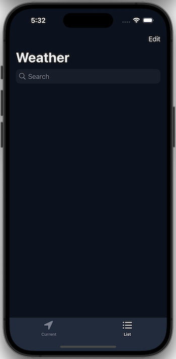
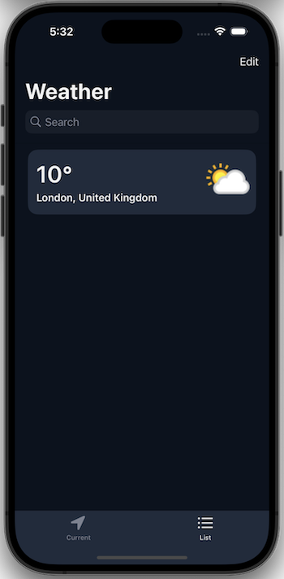

# Weather

Pet project for AstonDevs 

Application get weather information obtained from current coordinates. User can search another regions and save it in storage.

## Stack: 
- UIkit
- UI layout via code (UIKIt)
- HTTP requests (URLSession, REST API)
- MVVM + Coordinator
- SOLID
- Core Data
- CoreLocation
- Reactive Programming (Combine) 

## Screenshots:

Weather information obtained from current coordinates:

  

Saved weather information in storage:

   

## 🔗 Links

