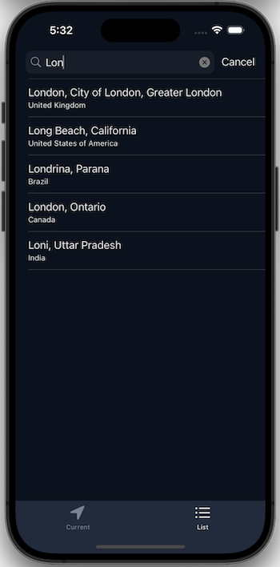

# Weather

Pet project for AstonDevs 

Applicvation get weather information with user current location. User can search another regions and save it in storage.

## Stack: 
- UIkit
- UI layout via code (UIKIt)
- HTTP requests (URLSession, REST API)
- MVVM + Coordinator
- SOLID
- Core Data
- CoreLocation
- Reactive Programming (Combine) 

## Screenshots:

Weather information obtained from current coordinates:

 {:height="350px" width="720px"}  {:height="350px" width="720px"}  {:height="350px" width="720px"}

Saved weather information in storage:

 {:height="350px" width="720px"}  {:height="350px" width="720px"}  {:height="350px" width="720px"}  {:height="350px" width="720px"}

## 🔗 Links

